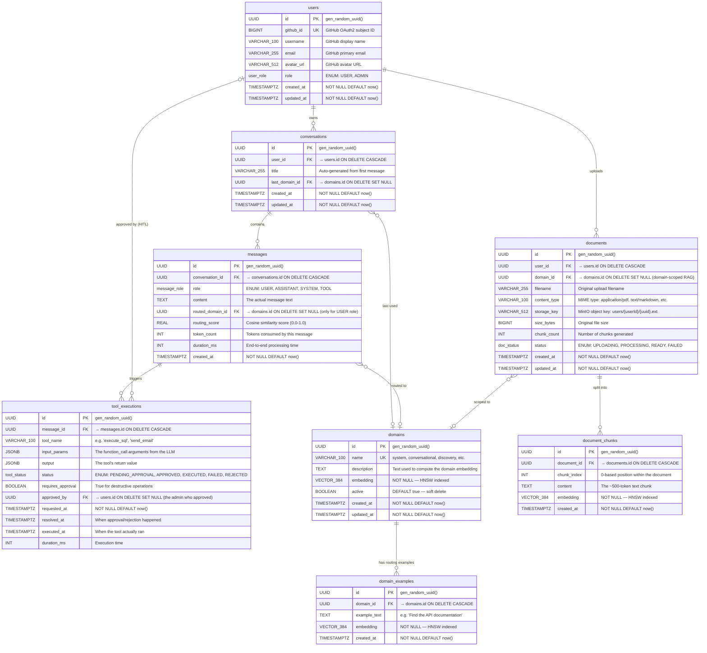

# Cairn — Complete Technical Specification

> **Purpose:** This document describes everything that will exist in the final project. Read it, question anything unclear, and once we agree — this becomes the blueprint that drives every Epic.

---

## 1. System Overview

Cairn is a **multi-agent AI orchestration platform** that:
1. Accepts user input via a React chat interface
2. Routes the intent to one of 6 specialized domain agents using semantic vector similarity (~20ms, CPU-only, zero tokens)
3. Retrieves domain-specific context via RAG (pgvector) and conversation memory (Redis + PostgreSQL)
4. Generates a response by calling a locally-hosted, custom-built fine-tuned LLM via Ollama
5. Streams tokens back to the user in real-time via Server-Sent Events (SSE)
6. Executes real-world actions via sandboxed tools when an agent decides to act
7. Publishes all events (routing decisions, tool calls, token usage) to Kafka for audit and analytics
8. Observes every step with Micrometer metrics, distributed tracing (Zipkin), and structured JSON logs
9. Secures every action with OAuth2 (GitHub login), JWT tokens, role-based access, and human-in-the-loop gates
10. Runs on Kubernetes (Minikube locally, cloud K8s optionally)

---

## 2. Complete Technology Stack

| Layer | Technology | Why This Over Alternatives |
|-------|-----------|---------------------------|
| **Frontend** | React 18 + Vite + TypeScript | Industry standard SPA. Vite is faster than CRA. TypeScript catches bugs at compile time. |
| **Frontend Styling** | Tailwind CSS or Vanilla CSS | User preference needed. Tailwind is faster to build with, Vanilla shows deeper CSS knowledge. |
| **Frontend Hosting** | Nginx container (separate K8s pod) | Enterprise pattern: frontend and backend are separate deployable units. |
| **Backend Framework** | Spring Boot 3.5 + Spring Modulith | Modular monolith — microservice boundaries without microservice overhead. |
| **API Layer** | REST + SSE (Server-Sent Events) | REST for CRUD, SSE for streaming LLM tokens. SSE chosen over WebSocket because it's simpler, works with HTTP/2, doesn't need sticky sessions (K8s compatible), and is what OpenAI/ChatGPT uses. |
| **AI Framework** | Spring AI 1.1.7 | Unified abstraction over Ollama + OpenAI. Keeps both starters so we can fall back to cloud if needed. |
| **Local LLM** | Ollama | Simplest local inference server. Manages GGUF model loading/unloading via REST API. |
| **Embeddings** | DJL + all-MiniLM-L6-v2 (CPU) | 384-dim embeddings at ~20ms, zero GPU usage, zero API cost. Already implemented. |
| **Vector Database** | PostgreSQL + pgvector | Single database for both relational data and vector search. Eliminates Pinecone/Weaviate cost. |
| **Cache** | Redis 7 | Conversation context cache with TTL. Also backs distributed rate limiting. |
| **Message Broker** | Apache Kafka (KRaft mode) | Event streaming for audit logs, analytics, and async tool execution. KRaft eliminates ZooKeeper dependency. |
| **Object Storage** | MinIO | S3-compatible storage for uploaded documents (RAG). Runs locally, maps to real S3 in prod. |
| **Auth** | Spring Security + OAuth2 (GitHub) + JWT | OAuth2 handles login. Backend issues its own JWT. This proves knowledge of BOTH OAuth2 AND JWT. |
| **Rate Limiting** | Bucket4j + Redis | Distributed, per-user rate limiting that survives restarts and works across K8s pods. |
| **Observability** | Micrometer + Prometheus + Grafana | Metrics collection → storage → visualization. Industry standard. |
| **Tracing** | Micrometer Tracing + Zipkin | Distributed request tracing across modules. Shows a request's journey through routing → RAG → LLM → tools. |
| **Logging** | SLF4J + Logback (JSON) | Structured logs with correlation IDs. Already implemented. |
| **Resilience** | Resilience4j | Circuit breakers, retry, bulkhead around Ollama and Redis calls. |
| **Schema Migrations** | Flyway | Versioned SQL migrations. Already implemented. |
| **Testing** | JUnit 5 + Testcontainers + k6 | Unit → Integration (real containers) → Load testing. |
| **CI/CD** | GitHub Actions | Build → Test → Docker → Deploy. |
| **Container Runtime** | Docker + Kubernetes (Minikube) | Docker for images, K8s for orchestration. |
| **K8s Packaging** | Helm | Package K8s manifests into versioned, configurable charts. |
| **ML Pipeline** | PyTorch (custom) | Hand-written Llama-3 architecture, LoRA, training loop, GGUF export. |

### Technologies That Add Resume Value (Newly Added)
- **Kafka** — Event-driven architecture, audit streaming, async tool execution
- **MinIO** — S3-compatible object storage for document uploads
- **Helm** — K8s package management
- **Resilience4j** — Circuit breakers, retry patterns
- **Zipkin** — Distributed tracing
- **k6** — Load/performance testing

---

## 3. Database Schema (Complete ERD)

### Entity Relationship Diagram



### Relationships Summary

| Parent | Child | FK Column | Cardinality | ON DELETE |
|--------|-------|-----------|-------------|-----------|
| `users` | `conversations` | `conversations.user_id` | 1:N | CASCADE (delete user → delete all their conversations) |
| `users` | `documents` | `documents.user_id` | 1:N | CASCADE (delete user → delete all their uploads) |
| `users` | `tool_executions` | `tool_executions.approved_by` | 1:N | SET NULL (admin deleted → approval record preserved) |
| `conversations` | `messages` | `messages.conversation_id` | 1:N | CASCADE (delete conversation → delete all messages) |
| `messages` | `tool_executions` | `tool_executions.message_id` | 1:N | CASCADE (delete message → delete tool records) |
| `domains` | `domain_examples` | `domain_examples.domain_id` | 1:N | CASCADE (delete domain → delete its examples) |
| `domains` | `conversations` | `conversations.last_domain_id` | 1:N | SET NULL (domain deleted → conversation keeps existing) |
| `domains` | `messages` | `messages.routed_domain_id` | 1:N | SET NULL (domain deleted → routing history preserved) |
| `domains` | `documents` | `documents.domain_id` | 1:N | SET NULL (domain deleted → document keeps existing) |
| `documents` | `document_chunks` | `document_chunks.document_id` | 1:N | CASCADE (delete document → delete all chunks) |

### Indexes

| Table | Index | Type | Purpose |
|-------|-------|------|---------|
| `domains` | `idx_domains_embedding` | HNSW (vector_cosine_ops) | Semantic routing — find closest domain |
| `domain_examples` | `idx_domain_examples_embedding` | HNSW (vector_cosine_ops) | Semantic routing — find closest example query |
| `document_chunks` | `idx_document_chunks_embedding` | HNSW (vector_cosine_ops) | RAG retrieval — find relevant document chunks |
| `conversations` | `idx_conversations_user_id` | B-tree | "Get all conversations for user X" |
| `messages` | `idx_messages_conversation_id` | B-tree | "Get all messages in conversation Y" |
| `messages` | `idx_messages_created_at` | B-tree | "Get last N messages ordered by time" |
| `documents` | `idx_documents_user_domain` | B-tree (composite) | "Get all documents for user X in domain Y" |
| `tool_executions` | `idx_tool_exec_status` | B-tree | "Get all pending HITL approvals" |
| `users` | `idx_users_github_id` | B-tree (unique) | "Find user by GitHub login" |

### Enums

| Enum Name | Values | Used By |
|-----------|--------|---------|
| `user_role` | `USER`, `ADMIN` | `users.role` |
| `message_role` | `USER`, `ASSISTANT`, `SYSTEM`, `TOOL` | `messages.role` |
| `tool_status` | `PENDING_APPROVAL`, `APPROVED`, `EXECUTED`, `FAILED`, `REJECTED` | `tool_executions.status` |
| `doc_status` | `UPLOADING`, `PROCESSING`, `READY`, `FAILED` | `documents.status` |

### Flyway Migration Plan

| Version | Description | Tables Affected |
|---------|-------------|-----------------|
| V1 (exists) | Base schema — pgvector + domains + HNSW index | `domains` |
| V2 | Users + OAuth2 fields | `users` |
| V3 | Conversations + messages | `conversations`, `messages` |
| V4 | Domain examples (routing accuracy upgrade) | `domain_examples` |
| V5 | Documents + chunks (RAG pipeline) | `documents`, `document_chunks` |
| V6 | Tool executions (HITL audit trail) | `tool_executions` |
| V7 | Add composite indexes for query optimization | All tables |

---

## 4. The Complete Request Lifecycle (End-to-End)

```
User types: "Analyze my Q3 revenue data by region"
         │
         ▼
┌─ React Frontend ─────────────────────────────────┐
│  1. POST /api/v1/chat { message, conversationId } │
│  2. Opens SSE connection for streaming response    │
└────────────────────────┬──────────────────────────┘
                         │ (HTTP + JWT in header)
                         ▼
┌─ Spring Boot (ChatController) ───────────────────┐
│  3. Validate JWT → extract userId, role            │
│  4. Validate input (@Valid)                        │
│  5. Rate limit check (Bucket4j + Redis)            │
└────────────────────────┬──────────────────────────┘
                         │
                         ▼
┌─ Routing Module ─────────────────────────────────┐
│  6. LocalEmbeddingService.embed(userText)          │
│     → 384-dim float[] on CPU (~20ms)               │
│  7. DomainRouter: pgvector HNSW cosine search      │
│     → Result: "analytical" domain (score: 0.92)    │
│  8. Publish DomainRoutedEvent to Kafka             │
└────────────────────────┬──────────────────────────┘
                         │
                         ▼
┌─ Agents Module ──────────────────────────────────┐
│  9. AgentOrchestrator selects AnalyticalAgent      │
│  10. Agent retrieves context:                      │
│      a. Redis: recent conversation context         │
│      b. PostgreSQL: last 10 messages               │
│      c. pgvector RAG: relevant DB schemas          │
│  11. Agent builds the mega-prompt:                 │
│      [System persona + Context + RAG chunks + Q]   │
└────────────────────────┬──────────────────────────┘
                         │
                         ▼
┌─ Model Module ───────────────────────────────────┐
│  12. Check which GGUF is loaded in Ollama          │
│  13. If wrong model: POST /api/pull to swap        │
│      (swap latency: ~2-3 seconds)                  │
│  14. Spring AI ChatClient → Ollama /api/chat       │
│      with stream=true                              │
│  15. Tokens stream back through SSE to frontend    │
└────────────────────────┬──────────────────────────┘
                         │
                         ▼ (if agent decides to use a tool)
┌─ Tools Module ───────────────────────────────────┐
│  16. LLM outputs a function_call JSON              │
│  17. If destructive: pause, publish to HITL queue  │
│      → Wait for admin approval via Kafka           │
│  18. If safe: execute tool immediately             │
│  19. Feed tool result back to LLM for next turn    │
│  20. Publish ToolExecutedEvent to Kafka            │
└────────────────────────┬──────────────────────────┘
                         │
                         ▼
┌─ Persistence ────────────────────────────────────┐
│  21. Save user message + assistant response to     │
│      messages table (PostgreSQL)                   │
│  22. Update Redis context cache                    │
│  23. Publish analytics event to Kafka              │
└──────────────────────────────────────────────────┘
```

---

## 5. The LoRA & Custom LLM Pipeline (Your Question Answered)

### How LoRA Works (The Math)
```
Standard weight update:  W_new = W_old + ΔW
LoRA decomposes ΔW:     ΔW = B × A

Where:
  W_old = Llama-3.2-1B base weights (frozen, never touched)
  A = Low-rank matrix (1B × rank), initialized randomly
  B = Low-rank matrix (rank × 1B), initialized to zero
  rank = 16 or 32 (tiny compared to full weight dimensions)

During training: Only A and B are updated. W_old stays frozen.
After training:  W_final = W_old + (B × A)  ← merged into single tensor
```

### The Pipeline For Each Domain
```
Step 1: Write model.py     → Custom Llama-3 Transformer (RoPE, GQA, SwiGLU, RMSNorm)
Step 2: Write loader.py    → Load Llama-3.2-1B safetensors into our custom architecture
Step 3: Write lora.py      → Inject A, B matrices into q_proj and v_proj of each layer
Step 4: Write train.py     → Train on domain-specific dataset (cloud GPU, ~1 hour per domain)
Step 5: Write export.py    → Merge B×A into W_old, save as HuggingFace format
Step 6: convert-hf-to-gguf → Quantize merged weights to 4-bit GGUF (~1GB per domain)
Step 7: Create Ollama Modelfile → Register each GGUF as an Ollama model
```

### What Ollama Does At Runtime
```
Spring Boot says: "Load the analytical model"
  → Ollama unloads current model from GPU VRAM
  → Ollama loads analytical.gguf into 4GB VRAM (~2-3 seconds)
  → Spring AI sends the mega-prompt
  → Ollama generates tokens using the fine-tuned model
  → Tokens stream back via SSE
```

You CANNOT hot-swap just the ΔW at the Ollama level because GGUF is a single pre-merged, pre-quantized file. Each domain = separate GGUF = separate Ollama model name. Swapping means unloading one file and loading another.

---

## 6. Kafka Integration (Where It Fits)

Kafka does NOT sit in the main chat flow (that stays synchronous SSE for latency reasons). Kafka handles the **side-effects**:

| Kafka Topic | Producer | Consumer | Purpose |
|-------------|----------|----------|---------|
| `cairn.routing.events` | DomainRouter | AnalyticsConsumer | Track which domains are hit, routing accuracy |
| `cairn.tool.executions` | ToolExecutor | AuditConsumer | Immutable audit trail of all tool calls |
| `cairn.tool.approvals` | HITL API | ToolExecutor | Admin approves/rejects a destructive tool call |
| `cairn.metrics.tokens` | LLM integration | MetricsConsumer | Track token usage per user, per domain |
| `cairn.documents.ingested` | DocumentUploadService | ChunkingConsumer | Async document chunking + embedding pipeline |

**Why Kafka and not just Spring Events?**
- Spring Modulith events are great for in-process communication (and we WILL use them too)
- Kafka provides **persistence** (events survive restarts), **replay** (re-process old events), and **multi-consumer** (audit + analytics read the same event)
- Using both shows you understand when each pattern is appropriate

---

## 7. Document RAG Pipeline (Your Question Answered)

Two document sources, both feeding into pgvector:

### Source 1: User-Uploaded Documents
1. User uploads a PDF/Markdown/TXT file via the React UI
2. Spring Boot saves the file to MinIO (S3-compatible storage)
3. A Kafka event `cairn.documents.ingested` is published
4. The `ChunkingConsumer` picks it up:
   - Splits the document into ~500-token chunks with overlap
   - Embeds each chunk via `LocalEmbeddingService` (CPU, 384-dim)
   - Saves chunks + embeddings to `document_chunks` table (pgvector)
5. When the Discovery agent receives a query, it searches `document_chunks` via HNSW

### Source 2: Pre-Loaded Domain Knowledge
- System-level domain documents (e.g., tool descriptions, database schemas) are loaded at startup via `DomainSeeder`
- These are stored in the `domain_examples` table
- The Analytical agent searches database schema descriptions
- The Execution agent searches tool descriptions

---

## 8. Conversation Persistence (Industry Standard)

```
Short-term (hot):  Redis (DomainContextCacheService)
                   TTL = 1 hour
                   Used for: immediate context injection into prompts

Long-term (cold):  PostgreSQL (conversations + messages tables)
                   No TTL — permanent
                   Used for: conversation history, analytics, user experience

Flow:
  1. User sends message → saved to PostgreSQL immediately
  2. Last N messages (configurable, default 10) are also pushed to Redis
  3. On next request: read from Redis first (fast)
  4. If Redis miss: fall back to PostgreSQL query (slower but complete)
  5. Agent gets: system prompt + Redis context + RAG chunks + user query
```

---

## 9. Testing Strategy (LLM Non-Determinism Solved)

| Test Type | What It Validates | How Non-Determinism Is Handled |
|-----------|-------------------|-------------------------------|
| **Unit Tests** (Mockito) | Business logic, routing, DTOs | LLM is mocked. Returns fixed responses. |
| **Integration Tests** (Testcontainers) | Full pipeline with real DB/Redis/Kafka | LLM is mocked via a WireMock Ollama stub. |
| **Contract Tests** | API request/response shapes | No LLM involved. |
| **Schema Validation Tests** | Analytical agent outputs valid JSON/SQL | Assert output parses as valid JSON. Assert SQL is syntactically correct. Don't check exact values. |
| **Tool Call Tests** | Agent calls the right tool with right params | Assert function_call name and parameter schema. Don't assert the "reasoning" text. |
| **Load Tests** (k6) | Routing handles 500 concurrent requests | LLM is mocked. Tests routing + DB + Redis under load. |
| **Eval Pipeline** (optional) | Actual output quality | Run same prompt 5 times, score with semantic similarity. Offline, not in CI. |

---

## 10. Infrastructure Topology

### Local Development (docker-compose)
```
┌─────────────────────────────────────────────────┐
│                Your Laptop (16GB RAM)            │
│                                                  │
│  ┌──────────┐ ┌───────┐ ┌───────┐ ┌──────────┐ │
│  │PostgreSQL│ │ Redis │ │ Kafka │ │  MinIO   │ │
│  │ pgvector │ │  7    │ │ KRaft │ │  (S3)   │ │
│  │  ~512MB  │ │~128MB │ │~512MB │ │ ~256MB  │ │
│  └──────────┘ └───────┘ └───────┘ └──────────┘ │
│                                                  │
│  ┌──────────┐ ┌───────────┐ ┌─────────────────┐ │
│  │  Ollama  │ │Spring Boot│ │ React (Vite dev)│ │
│  │ GTX 1650 │ │  JVM      │ │   localhost:5173│ │
│  │  ~3.5GB  │ │  ~512MB   │ │     ~128MB      │ │
│  └──────────┘ └───────────┘ └─────────────────┘ │
│                                                  │
│  ┌───────────┐ ┌──────────┐                     │
│  │Prometheus │ │  Zipkin  │  (optional locally) │
│  │  ~256MB   │ │  ~256MB  │                     │
│  └───────────┘ └──────────┘                     │
│                                                  │
│  Total: ~5.5GB (without monitoring)              │
│         ~6GB   (with monitoring)                 │
│  Free:  ~10GB for OS + IDE + browser             │
└─────────────────────────────────────────────────┘
```

### Kubernetes (Minikube)
```
Minikube adds ~2GB overhead for the control plane.
Total: ~8GB. Still fits in 16GB with ~8GB free.

K8s Resources:
  - Deployment: cairn-backend (2 replicas for scaling demo)
  - Deployment: cairn-frontend (Nginx + React build)
  - StatefulSet: postgres
  - StatefulSet: kafka
  - Deployment: redis, minio, ollama
  - Service: ClusterIP for internal, NodePort/Ingress for external
  - HPA: Auto-scale backend based on CPU usage
  - ConfigMap: application.yml externalized
  - Secret: JWT secret, OAuth2 credentials, DB passwords
  - Ingress: Route /api/* to backend, /* to frontend
```

---

## 11. Module Responsibilities (Clarified)

| Module | Package | Responsibility |
|--------|---------|---------------|
| **routing** | `com.cairn.routing` | Semantic routing (embeddings, pgvector search, domain resolution), Redis context cache, document chunking |
| **model** | `com.cairn.model` | Ollama lifecycle management (load/unload/health), Spring AI ChatClient configuration, model registry |
| **agents** | `com.cairn.agents` | SwarmAgent interface, 6 domain agent implementations, prompt construction, RAG context assembly |
| **tools** | `com.cairn.tools` | Tool registry, sandboxed execution, HITL approval queue, tool result processing |
| **observability** | `com.cairn.observability` | GlobalExceptionHandler, Micrometer custom metrics, health indicators, Kafka analytics consumers |
| **security** | `com.cairn.security` | OAuth2 config, JWT filter, rate limiting, CORS, role-based access |

### Inter-Module Communication
Modules communicate via **Spring Modulith Application Events** (not direct method calls):
```
routing publishes:   DomainRoutedEvent(userId, domain, score, latencyMs)
agents  listens to:  DomainRoutedEvent → starts the correct agent
agents  publishes:   AgentCompletedEvent(conversationId, response, tokenCount)
tools   publishes:   ToolExecutionRequestedEvent(toolName, params, requiresApproval)
security listens to: ToolExecutionRequestedEvent → checks HITL gate
```

These internal events are ALSO externalized to Kafka for persistence and analytics.

---

## 12. Design Patterns (Explicitly Named for SDE Interviews)

| Pattern | Where Used | Why |
|---------|-----------|-----|
| **Strategy** | `SwarmAgent` interface + 6 implementations | Each domain agent is a strategy. The orchestrator selects the right one at runtime. |
| **Factory** | `ToolFactory` | Creates the correct tool instance based on the LLM's function_call name. |
| **Observer** | Spring Modulith Events | Modules observe events without coupling. `DomainRoutedEvent` → multiple listeners. |
| **Circuit Breaker** | Resilience4j around Ollama | Prevents cascade failure when the LLM server is overloaded. |
| **Repository** | Spring Data JPA repositories | Data access abstraction. Already in use. |
| **Builder** | Prompt construction in agents | Complex mega-prompts are assembled step-by-step. |
| **Template Method** | Base `AbstractDomainAgent` | Common agent logic (context retrieval, prompt building) with domain-specific hooks. |
| **Decorator** | Rate limiting filter wrapping the security chain | Adds behavior (rate limiting) without modifying the core filter chain. |

---

## 13. SDE Non-Negotiable Standards

These are woven into every Epic. They are not optional.

| # | Standard | Rule |
|---|----------|------|
| 1 | **DTO layer** | No JPA entity ever leaves the service layer. Every API input/output uses a DTO. Mapping via MapStruct or manual mapper class. |
| 2 | **Pagination** | Every list endpoint accepts `Pageable` and returns `Page<T>`. No unbounded list queries. |
| 3 | **@ConfigurationProperties** | Every external service gets a type-safe config class: `CairnOllamaProperties`, `CairnRateLimitProperties`, `CairnEmbeddingProperties`. |
| 4 | **Custom AOP annotation** | `@Audited` on service methods — logs entry, exit, duration, and exceptions via AOP. |
| 5 | **Exception hierarchy** | Base `CairnException` → `DomainNotFoundException`, `ModelNotLoadedException`, `RateLimitExceededException`, etc. Each mapped to HTTP status in `GlobalExceptionHandler`. |
| 6 | **Spring Profiles** | `application-dev.yml`, `application-prod.yml`. Dev uses localhost defaults. Prod uses env vars. |
| 7 | **@Scheduled cleanup** | At least one: purge expired Redis keys, clean orphaned document chunks, rotate audit logs. |
| 8 | **State machine** | `tool_executions.status` transitions enforced: PENDING_APPROVAL → APPROVED → EXECUTED. Illegal transitions (e.g., EXECUTED → PENDING) throw `IllegalStateTransitionException`. |
| 9 | **@Cacheable** | Domain lookups and embedding model config cached via Spring Cache abstraction backed by Redis. |
| 10 | **Complex JPA query** | At least one multi-join query with pagination and dynamic filtering (conversation history search across messages + domains + users). |

---

## 14. Platform Management API Surface

The AI chat is one endpoint. The rest is traditional Spring Boot CRUD.

### Chat (AI Surface)
| Method | Endpoint | Auth | Description |
|--------|----------|------|-------------|
| POST | `/api/v1/chat` | USER | Send message, receive SSE streaming response |

### Conversations
| Method | Endpoint | Auth | Description |
|--------|----------|------|-------------|
| GET | `/api/v1/conversations` | USER | List my conversations (paginated, sortable) |
| GET | `/api/v1/conversations/{id}/messages` | USER | Get message history (paginated) |
| DELETE | `/api/v1/conversations/{id}` | USER | Delete a conversation and all messages |

### Domains (Admin)
| Method | Endpoint | Auth | Description |
|--------|----------|------|-------------|
| GET | `/api/v1/domains` | USER | List all active domains |
| POST | `/api/v1/domains` | ADMIN | Create a new domain |
| PUT | `/api/v1/domains/{id}` | ADMIN | Update domain description (re-embeds automatically) |
| DELETE | `/api/v1/domains/{id}` | ADMIN | Soft-delete (set active=false) |
| GET | `/api/v1/domains/{id}/examples` | USER | List routing examples for a domain |
| POST | `/api/v1/domains/{id}/examples` | ADMIN | Add a routing example (auto-embeds) |
| DELETE | `/api/v1/domains/{id}/examples/{exId}` | ADMIN | Remove a routing example |

### Documents (RAG)
| Method | Endpoint | Auth | Description |
|--------|----------|------|-------------|
| POST | `/api/v1/documents` | USER | Upload a document (multipart, max 10MB) |
| GET | `/api/v1/documents` | USER | List my documents (paginated, filterable by domain) |
| GET | `/api/v1/documents/{id}` | USER | Get document metadata + chunk count |
| GET | `/api/v1/documents/{id}/chunks` | USER | View chunks + embeddings (paginated) |
| DELETE | `/api/v1/documents/{id}` | USER | Delete document + chunks + MinIO object |

### Tool Approvals (HITL)
| Method | Endpoint | Auth | Description |
|--------|----------|------|-------------|
| GET | `/api/v1/tools/approvals` | ADMIN | List pending approvals (paginated) |
| POST | `/api/v1/tools/approvals/{id}/approve` | ADMIN | Approve → triggers execution |
| POST | `/api/v1/tools/approvals/{id}/reject` | ADMIN | Reject → marks as REJECTED |
| GET | `/api/v1/tools/executions` | ADMIN | Full audit log (paginated, filterable by tool, status, date) |

### Users
| Method | Endpoint | Auth | Description |
|--------|----------|------|-------------|
| GET | `/api/v1/users/me` | USER | My profile (from JWT) |
| GET | `/api/v1/admin/users` | ADMIN | List all users (paginated) |
| PUT | `/api/v1/admin/users/{id}/role` | ADMIN | Change user role |

### Analytics
| Method | Endpoint | Auth | Description |
|--------|----------|------|-------------|
| GET | `/api/v1/analytics/routing` | ADMIN | Domain hit distribution, avg routing latency |
| GET | `/api/v1/analytics/usage` | ADMIN | Token usage per user, per domain, per time period |

---

## What This Document Does NOT Cover (Intentionally)

- Exact React component hierarchy (will be designed in Epic 4)
- Specific Grafana dashboard panels (will be designed in Epic 7)
- Helm chart values (will be designed in Epic 8)
- Training dataset contents for LoRA (will be designed in Epic 9)
- k6 load test script details (will be designed in Epic 10)

These are implementation details that belong in their respective Epic PRE-GATEs, not in the architectural specification.

---

> [!IMPORTANT]
> **This document is ready for your review.** Ask any questions about any section. Once you're satisfied, I will convert this into the final granular Epic/Task roadmap with execution-level instructions for Gemini.

